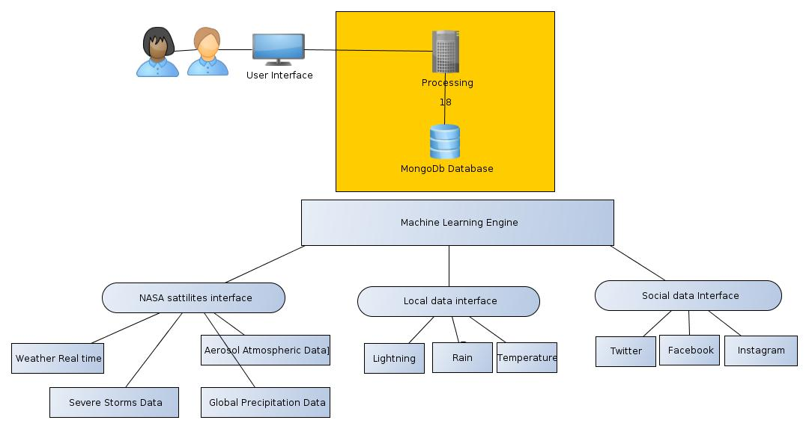

Team Flash - Space APPS 2017

Impact: this Project innovates in flexible threting of probes from source and acquisition of data, using social networks, satellites and microcontrollers, device mobile sensors (cellphones / tablets) as well LPWAN sensors integrating many bases of data creating an only vision to the user at Same time that provides to them techniques of machine learning to analytics and correlation of data.

The project model allows it to be flexible in terms of growth and data collection. The project is distributed under GPL license, we currently divide the probes into 3 categories:
  - Out of earth: provided by devices, EX: Satellites, spaceships, historical data, etc.
  - Locations: provided by microcontrollers: probes for caption of relative data and local climatic phenomenon(mass storm, lighting, rains, thunders,etc)
  - Social: provided by human beings through analysis of public pattern in profiles, beyond of correlational data correlattionated the location of perfile.

Thereby, this project aims to balance pros and cons of traditional source data types creating a point of acceptance both from a commercial point of view and accurate in the analysis of data. Each type of probe have their own advantages/disadvantages.

Probes per device:Pros - high accurate rate of generated data - Possibility of calibration and adequacy of sensors to meet specific purposes, Operating scale adjustment - Requires equipment costs - Requite maintenance costs - Require costs in maintenance - High costs in transmission.

Probes provided by social networks:
  - Low coast of data acquisition.
  - Don’t require hardware.
  - Allow global collect of data standard.
  - low costs of maintenance.

Cons:
  - False alarmes, need to large sample to reduce percentage of errors.

The project uses free source code, under GPL license. Using the programming languages C and Python.

It allow us to improve our code using collaborative structure work provided by Github, where anyone can make a fork of this project, understand the mechanism used for development of the methodology and send suggestions to improve it.

The operations flow of the project is described in the file FluxoProjeto.graphml

All the initial development thereby conclude modules were created during NASA Space apps 2017, where they conclude The following modules:

Local collect:
  - collecting probe data using ESP8666-12, Using wireless data communication for the data collection API.
  - communication using SocketIO, Guaranteeing high speed in the transmission of events occurred in microcontrollers.
  - Easy configuration of microcontrollers with full WPS support.
  - Operation using real and emulated probes (in case of sensor failure).
  - WIFI signal level also used as local device pickup probe.

Social collect:
  - scan of twitters profiles looking for Related patterns to climatic events.
  - Intelligent analysis probe, with support for the detection of expressions in English and Portuguese of Brazil.
  - Mechanism of detection of natural tragedies based.
  - Detection of the level of criticality and prioritization of the message according to the level of detected patterns (earthquakes, tsunamis has more urgency and preference than rain, sun).

No SQL database:
 - Data storage in appropriate format for searching using NOSQL format.
 - Data collection oriented.
 - It can store data in different ways without a standard and inflexible structure being defined at the beginning of the project, thus allowing the most diverse types of data coming from different sources without the performance being affected or any change or maintenance is necessary for the insertion of new Fields or data type.
